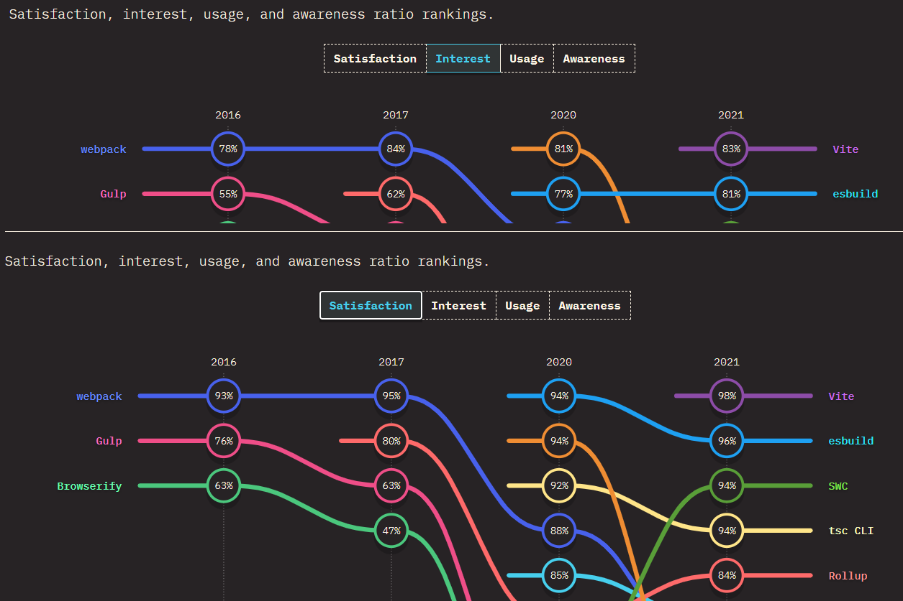

# 제로베이스 PART2 과제 - 쇼핑몰 만들기 with React

---
+ Verel
+ Sass
+ React
+ TypeScript

---
## Vite 
### 왜 빌드툴로 Vite를 선택했나요?
[State of JS 2021](https://2021.stateofjs.com/en-US/libraries/build-tools)에서 확인해본 결과,   
2021년 기준 __만족도__ 와 __흥미도__ 부분에서 각각 98%와 83%로 사용빈도가 높아질 것이라 생각하여 빌드툴로 선택했다. 

---